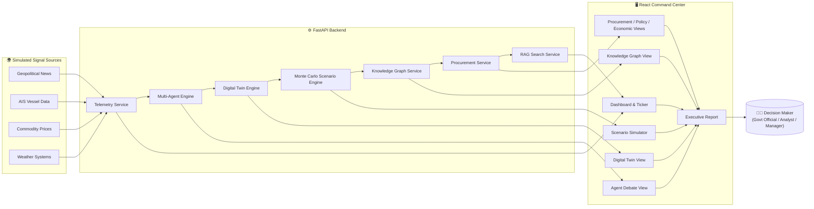

<div align="center">

# 🛡️ URJA KAVACH
### उर्जा कवच · India's AI-Powered Energy Supply Chain Resilience Command Center

**Turning geopolitical shocks into predictable, actionable intelligence — before they become fuel crises.**

[](#-tech-stack)
[](#-tech-stack)
[](#-tech-stack)
[](#-disclaimer)
[](#)

</div>

---

## 📑 Table of Contents

- [1. The Problem](#1-️-the-problem)
- [2. The Solution](#2--the-solution--what-urja-kavach-does)
- [3. How It Solves the Problem](#3--how-it-solves-the-problem)
- [4. System Architecture](#4-️-system-architecture)
- [5. Tech Stack](#5-️-tech-stack)
- [6. API Reference](#6--api-reference)
- [7. Project Structure](#7--project-structure)
- [8. Getting Started](#8--getting-started)
- [9. Roadmap](#9--roadmap)
- [10. Disclaimer](#10--disclaimer)

---

## 1. 🎯 The Problem

India imports roughly **85% of its crude oil** and a significant share of its natural gas, moving it through a small number of high-risk global chokepoints — the **Strait of Hormuz**, the **Bab al-Mandab / Red Sea corridor**, and long open-ocean routes from Russia and West Africa — before it ever reaches an Indian port, refinery, pipeline, or consumer.

This creates a structural vulnerability:

<table>
<tr><td width="40%" valign="top"><b>🎯 Single points of failure</b></td>
<td>A single blockade, naval standoff, cyclone, or refinery fire thousands of kilometers away can cascade into fuel shortages, price spikes, and industrial slowdowns inside India within days.</td></tr>
<tr><td valign="top"><b>🧩 Fragmented information</b></td>
<td>Shipping data (AIS), geopolitical intelligence, commodity prices, weather systems, sanctions regimes, and domestic infrastructure status live in separate silos, with no single system connecting the dots in real time.</td></tr>
<tr><td valign="top"><b>🐢 Slow, reactive decision-making</b></td>
<td>By the time analysts manually piece together <i>"missile threat near Yemen → tankers rerouting → delayed Gujarat refinery feedstock → diesel price pressure in North India,"</i> the window to act pre-emptively has often already closed.</td></tr>
<tr><td valign="top"><b>🎲 No systematic "what if" war-gaming</b></td>
<td>Policymakers rarely have a fast, quantitative way to ask <i>"What happens to India's energy security if the Strait of Hormuz shuts for 14 days?"</i> and get a probabilistic, data-backed answer in seconds.</td></tr>
</table>

> **The result:** India's energy security response is largely **reactive rather than predictive** — leaving the country exposed to avoidable economic shocks, inflation spikes, and supply emergencies.

---

## 2. 💡 The Solution — What Urja Kavach Does

Urja Kavach is a **command-center style web application** that fuses live-style telemetry, AI reasoning, and simulation into one console — built for the people who actually have to make energy-security decisions: government officials, policy makers, refinery managers, logistics managers, and energy analysts.

It continuously answers three questions:

<div align="center">

| 🔍 What's happening now? | 🔮 What could happen next? | 🧭 What should we do? |
|:---:|:---:|:---:|
| Situational Awareness | Prediction & Simulation | Decision Support & Action |

</div>

### Core Capabilities

| Module | What it Solves |
|---|---|
| 🖥️ **Main Dashboard** | A single real-time view of India's Energy Security Score, Composite Risk Index, Strategic Petroleum Reserve (SPR) days remaining, threat level, and live commodity/freight prices. |
| 🌐 **Digital Twin of the Supply Chain** `Flagship` | A live digital replica of India's oil & gas network — suppliers, transit chokepoints, ports, pipelines, refineries, reserves, demand centers — simulating cascading disruption from any single node. |
| 🗺️ **AIS & Geospatial Map** | Tracks tanker vessels, ports, and refineries geographically for visual exposure analysis. |
| 🤖 **Multi-Agent AI Debate** `10 Agents` | Ten specialized AI agents (News, Shipping, Commodity, Weather, Geopolitics, Risk, Scenario, Procurement, Policy, Economic) plus an Orchestrator reason through a crisis collaboratively. |
| 🎲 **Scenario Simulator** `Monte Carlo` | Thousands of probabilistic iterations against preset or custom crises (Hormuz blockade, Red Sea escalation, refinery outage, super-cyclone) forecasting supply gaps, price spikes, and recovery curves. |
| 🕸️ **Knowledge Graph** | Links countries, chokepoints, ports, refineries, vessels, sanctions, and weather systems, surfacing hidden second/third-order risks. |
| 💼 **Procurement Copilot** | AI-scored comparison of alternate crude suppliers (price, freight, transit time, geopolitical risk, carbon intensity) for rapid diversification. |
| 🏛️ **Policy Advisor & SPR** | Recommends Strategic Petroleum Reserve release strategies and government SOP actions. |
| 📈 **Commodity Intelligence** | Live tracking of Brent, WTI, Dubai crude, natural gas, retail fuel prices, and VLCC freight rates. |
| ⚓ **Ports & Pipelines** | Health and throughput status of India's key crude ports, SPM terminals, and pipelines. |
| 📊 **Economic Impact** | Translates supply disruptions into GDP, inflation, and fuel-deficit forecasts. |
| 🧭 **Mission Console AI** | Conversational command interface for querying the system and issuing simulated directives. |
| 📄 **Cabinet Briefing** | One-click executive report generation for senior government or corporate stakeholders. |

### 👥 Who It's For

<div align="center">

`Government Official` &nbsp;·&nbsp; `Policy Maker` &nbsp;·&nbsp; `Refinery Manager` &nbsp;·&nbsp; `Logistics Manager` &nbsp;·&nbsp; `Energy Analyst` &nbsp;·&nbsp; `Administrator`

</div>

Each role gets a tailored view into the same live command center.

---

## 3. 🔗 How It Solves the Problem

| ❌ Problem | ✅ Urja Kavach's Answer |
|---|---|
| Fragmented data across news, shipping, weather, and commodities | Unifies everything into one intelligence feed and one Knowledge Graph |
| Reactive, slow decision-making | AI Agent Debate + Mission Console deliver an assessed recommendation in real time, not days |
| No way to quantify "what if" | Monte Carlo Scenario Simulator turns hypothetical crises into probability-weighted forecasts |
| No visibility into cascading failure | Digital Twin shows exactly how a disruption ripples: suppliers → transit lanes → ports → refineries → consumers |
| Difficult supplier diversification under pressure | Procurement Copilot instantly ranks alternative suppliers on cost, risk, and speed |
| Disconnected economic consequences | Economic Impact module ties a supply shock directly to GDP/inflation/fuel-deficit numbers, packaged into Executive Reports |

---

## 4. 🏗️ System Architecture



---

## 5. 🛠️ Tech Stack

<table>
<tr>
<td valign="top" width="50%">

**Frontend**
- ⚛️ React 19 + TypeScript, built with Vite
- 🎨 Tailwind CSS 4
- 🎬 Framer Motion (animation)
- 📊 Recharts (data visualization)
- 🗺️ React-Leaflet (geospatial mapping)
- 🌐 React Three Fiber / drei / three.js (3D globe)
- ✨ Lucide React (iconography)

</td>
<td valign="top" width="50%">

**Backend**
- ⚡ FastAPI (Python) REST API
- 🧬 Pydantic (data modeling)
- 🔢 NumPy (Monte Carlo simulation math)
- 🦄 Uvicorn (ASGI server)

</td>
</tr>
</table>

---

## 6. 📡 API Reference

| Endpoint | Purpose |
|---|---|
| `GET /api/telemetry` | National risk metrics, threat level, SPR status |
| `GET /api/intelligence` | Live geopolitical intelligence feed |
| `GET /api/agents/debate` | Multi-agent crisis reasoning timeline |
| `GET /api/digital-twin` | Supply chain node network + cascading disruption simulation |
| `GET /api/scenario/monte-carlo` | Probabilistic scenario forecasting |
| `GET /api/knowledge-graph` | Entity relationship graph data |
| `GET /api/procurement/suppliers` | Supplier comparison data |
| `GET /api/procurement/negotiate` | AI-simulated supplier negotiation |
| `GET /api/rag/search` | Retrieval-augmented search over the intelligence corpus |
| `GET /api/vessels` | Live AIS tanker data |
| `GET /api/ports` | Indian port status |
| `GET /api/refineries` | Indian refinery status |

---

## 7. 📂 Project Structure

```
urja-kavach/
├── backend/
│   ├── app/
│   │   ├── main.py                 # FastAPI app & route definitions
│   │   └── services/
│   │       ├── telemetry.py        # National metrics & intelligence feed
│   │       ├── multi_agent.py      # 10-agent AI debate engine
│   │       ├── digital_twin.py     # Supply chain network & disruption cascade
│   │       ├── knowledge_graph.py  # Entity relationship graph
│   │       ├── procurement.py      # Supplier scoring & negotiation
│   │       ├── scenario_engine.py  # Monte Carlo crisis simulation
│   │       └── rag_search.py       # RAG-style intelligence search
│   ├── requirements.txt
│   └── run.py
└── frontend/
    ├── src/
    │   ├── components/              # Dashboard, Digital Twin, Map, Scenario, etc.
    │   ├── types/                   # Shared TypeScript types
    │   └── App.tsx                  # Application shell & role/tab routing
    └── package.json
```

---

## 8. 🚀 Getting Started

### Prerequisites
`Node.js 18+` &nbsp;·&nbsp; `npm` &nbsp;·&nbsp; `Python 3.10+`

### Backend
```bash
cd backend
pip install -r requirements.txt
python run.py
```
🔗 API available at `http://localhost:8000` &nbsp;(interactive docs at `/docs`)

### Frontend
```bash
cd frontend
npm install
npm run dev
```
🔗 App available at `http://localhost:5173`

---

## 9. 🗺️ Roadmap

- [ ] Integration with live AIS, satellite, and news APIs (currently realistic simulated telemetry)
- [ ] Persistent storage and historical trend analysis
- [ ] Authentication and role-based access control for production deployment
- [ ] Export of Executive/Cabinet reports to PDF/Word
- [ ] Real LLM-backed agent reasoning and RAG search (currently rule-based simulation)

---

## 10. ⚠️ Disclaimer

Urja Kavach is currently a **demonstration / prototype platform**. Telemetry, intelligence feeds, vessel data, and agent reasoning are simulated for demonstration purposes and do not reflect live operational data. It is designed to showcase how an AI-driven energy security command center *could* function, as a foundation for a production-grade national resilience system.

---

<div align="center">

*Built to make India's energy supply chain visible, predictable, and defensible — before a crisis becomes a crisis.*

**🛡️ URJA KAVACH**

</div>
